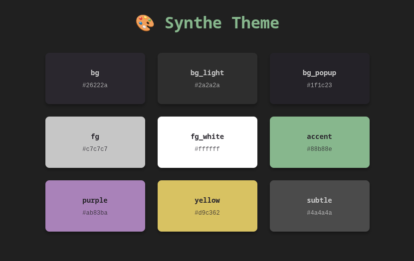

# Synthe Theme for VS Code

> A VS Code theme dripping in neon greens and electric purples. Built for hackers who code at medium
> brightness, and actually take a lot of notes or write documentation.

 [](screenshots/palette.png)

This is the VS Code port of the [Synthe theme for Vim/Neovim](https://github.com/sesav/synthe-theme).

## Installation

You can install the theme from the official extension store - `Synthe Theme`

## Manual Installation

1. Clone or download this repository:
   ```bash
   git clone https://github.com/sesav/synthe-theme-vscode.git
   cd synthe-theme-vscode
   ```

2. Copy the extension to your VS Code extensions folder:

   **Linux:**
   ```bash
   cp -r . ~/.vscode/extensions/synthe-theme/
   ```

   **macOS:**
   ```bash
   cp -r . ~/.vscode/extensions/synthe-theme/
   ```

   **Windows:**
   ```powershell
   xcopy /E /I . %USERPROFILE%\.vscode\extensions\synthe-theme\
   ```

3. Reload VS Code

### Method 3: Building from Source

If you want to build the `.vsix` package yourself:

1. Install dependencies:
   ```bash
   npm install -g @vscode/vsce
   ```

2. Clone the repository:
   ```bash
   git clone https://github.com/sesav/synthe-theme-vscode.git
   cd synthe-theme-vscode
   ```

3. Package the extension:
   ```bash
   vsce package
   ```

4. Install the generated `.vsix` file using "Install from VSIX" in the
Extensions tab of VS Code.

## Activation

After installation:

1. Open VS Code
2. Press `Ctrl+K Ctrl+T` (or `Cmd+K Cmd+T` on macOS) to open the theme picker
3. Select "Synthe" from the list

Or use the Command Palette:

1. Press `Ctrl+Shift+P` (or `Cmd+Shift+P` on macOS)
2. Type "Preferences: Color Theme"
3. Select "Synthe"

You can also set it in your `settings.json`:

```json
{
  "workbench.colorTheme": "Synthe"
}
```

## Contributing
Contributions are welcome! Please feel free to submit a Pull Request.